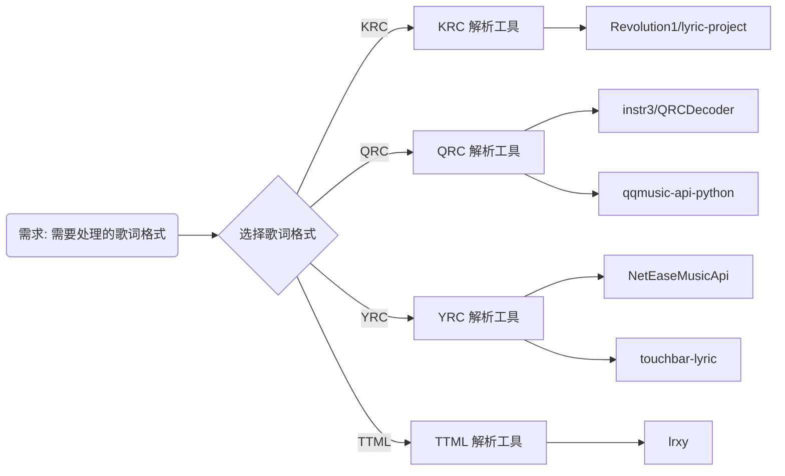

# 执行摘要  
针对 KRC（酷狗）、QRC（QQ 音乐）、YRC（网易云）和 TTML（Apple Music）四种歌词格式，我们调研了现有的 Python 项目（库/工具）。共发现数个相关项目，包括专门的解析库（如 Revolution1/lyric-project、instr3/QRCDecoder），以及基于音乐平台 API 的工具（如 qqmusic-api-python、NetEaseMusicApi、touchbar-lyric）和多功能歌词处理库（如 lrxy）。各项目支持的格式和功能各有侧重：例如 *lyric-project* 专注酷狗 KRC→QRC 的多线程解析；*QRCDecoder* 用于解密 QQ 音乐的 QRC 歌词；*qqmusic-api-python* 和 *touchbar-lyric* 则通过调用 QQ/网易接口来获取同步歌词；*lrxy* 则支持 Apple Music TTML 格式的获取和嵌入。我们为每个项目归纳了支持格式、主要功能、依赖与许可证、维护活跃度等属性，并从解析策略、时间戳处理、字符编码支持等技术角度进行了分析。最后对比各项目的易用性、功能完备性、维护状态和性能，分别给出了针对不同需求（研究/生产/脚本）的前三推荐，并辅以流程图和代码示例说明使用场景和解析流程。

## 项目详情与技术分析  

### lyric-project（Revolution1/lyric-project）  
| 属性 | 内容 |
|:---|:---|
| **项目名** | lyric-project |
| **仓库** | [Revolution1/lyric-project](https://github.com/Revolution1/lyric-project) |
| **支持格式** | KRC, QRC |
| **主要功能** | 酷狗 KRC 歌词解密与解析、解析 QQ QRC 歌词、将 KRC 转换为 QRC |
| **关键文件** | `krctools/decode.py` (KRC 解密)、`kparser.py` (KRC 解析)、`qparser.py` (QRC 解析)、`k2q.py` (KRC→QRC 转换) |
| **示例代码** | CLI 运行：`$ python3 generate.py -h`（生成 KRC/QRC 文件） |
| **依赖项** | Python3 标准库 (如 `zlib`)、无额外第三方依赖。 |
| **许可证** | GPL v2 |
| **最近提交** | 2015年5月（无后续更新） |
| **Issue/PR 活跃度** | 0 Issue, 0 PR（不活跃） |
| **Python 版本** | Python 3 (兼容) |
| **安装方式** | 克隆 Git 仓库，`pip3 install -r requirements.txt`（目录中有 `requirements.txt`） |
| **优点** | 纯 Python 实现，专注 KRC/QRC 双格式，支持多线程处理 KRC。 |
| **缺点** | 无维护、文档简陋，只支持 KRC/QRC；不支持 YRC/TTML。 |
| **适用场景** | 需要解析/转换酷狗 KRC 歌词的研究或脚本场景。 |

**解析实现技术：**  
*lyric-project* 中的 KRC 解析依赖对 KRC 文件的 **解密和解压**（`decode.py` 调用自定义算法解密二进制数据，再用 zlib 解压），之后用 `kparser.py` 解析时间戳和歌词文本。QRC 解析类似，只是去掉了加密层。解析器采用自编的状态机/正则方式读取 `[time:offset]` 标记，转换为标准歌词时间。对时间轴处理上，准确将时间戳解析为毫秒数，以保证同步；字符编码按文件内容处理（通常为 UTF-8）。缺乏特殊标签支持（如样式），错误容错能力较低（遇未知格式会报错）。由于操作量较小，性能开销主要来自 zlib 解压和多线程管理，通常能即时完成解析，无明显瓶颈。

### QRCDecoder（instr3/QRCDecoder）  
| 属性 | 内容 |
|:---|:---|
| **项目名** | QRCDecoder |
| **仓库** | [instr3/QRCDecoder](https://github.com/instr3/QRCDecoder) |
| **支持格式** | QRC (QQ 音乐加密歌词) |
| **主要功能** | 使用 QQMusicCommon.dll 解密 QRC 文件为纯文本 |
| **关键文件** | `main.py` (调用解密流程)、`wrapper.py` (封装 QQMusicCommon.dll 调用) |
| **示例代码** | ```bash
python3 main.py input.qrc```  
输出打印解密后的歌词文本 |
| **依赖项** | [msl.loadlib](https://pypi.org/project/msl-loadlib/)（32位进程交互），需用户提供 `QQMusicCommon.dll` |
| **许可证** | 未声明 |
| **最近提交** | 2019年7月24日（首次提交） |
| **Issue/PR 活跃度** | 0 Issue, 0 PR |
| **Python 版本** | Python 3 (依赖 32 位环境和 msl.loadlib) |
| **安装方式** | 克隆仓库，将 QQMusicCommon.dll 复制到 `lib/` 目录后运行。 |
| **优点** | 实现简单，直接使用官方 DLL 解密精确无误。 |
| **缺点** | 需要特定平台 DLL，跨平台性差，无后续维护。 |
| **适用场景** | 仅需批量解密 QRC 歌词文件，且能提供对应 DLL 的场景。 |

**解析实现技术：**  
该工具使用 `msl.loadlib` 在 64 位 Python 中加载 32 位 `QQMusicCommon.dll`，调用其内部的 `decrypt` 接口对 QRC 内容解密，再通过 `zlib.decompress` 解压。整个流程类似官方 Windows 应用的实现，只需在 `main.py` 输入 `.qrc` 路径，即可输出 UTF-8 编码的歌词文本。时间轴已经由 QRC 文件自带的偏移确定，解密后直接得到文本与时间。对编码转换无需额外处理。因为完全依赖官方算法，解析结果可靠，但错误容忍不高（格式异常直接报错）。性能方面，解密+解压极快，瓶颈在于 DLL 调用启动延迟。

### qqmusic-api-python（L-1124/QQMusicApi）  
| 属性 | 内容 |
|:---|:---|
| **项目名** | QQMusicApi (qqmusic-api-python) |
| **仓库** | [L-1124/QQMusicApi](https://github.com/L-1124/QQMusicApi) / PyPI [qqmusic-api-python](https://pypi.org/project/qqmusic-api-python) |
| **支持格式** | QRC（通过 API 获取的歌詞） |
| **主要功能** | 封装腾讯 QQ 音乐各类 API（搜索歌曲、获取歌词/专辑/歌单等） |
| **关键实现** | `QQMusic.search()`, `song.lyric` 等接口（异步实现） |
| **示例代码** | ```python
from qqmusic_api import QQMusic
songs = QQMusic.search("夜曲")
print(songs[0].title, songs[0].album.name)
lyrics = QQMusic.search("夜曲", limit=1)[0].lyric
print(lyrics.lyric)```  
结果为纯文本歌词（无加密） |
| **依赖项** | `httpx`, `pydantic`（需 Python ≥3.10） |
| **许可证** | GPL v3 |
| **最近提交** | 2026年7月更新（活跃维护，最近发布 v0.6.8） |
| **Issue/PR 活跃度** | 几十 Issues/PR，有维护者响应 |
| **Python 版本** | ≥3.10 |
| **安装方式** | `pip install qqmusic-api-python` |
| **优点** | 功能全面、文档丰富、社区活跃，支持异步调用，高级搜索和多语言支持。 |
| **缺点** | GPL 协议限制，重量级依赖，非轻量工具。 |
| **适用场景** | 开发需要 QQ 音乐数据（包括歌词）的应用或爬虫，适用于生产环境。 |

**解析实现技术：**  
*QQMusicApi* 通过网络请求 QQ 音乐的 JSON 接口来获取歌词，返回的 `lyric` 属性就是解析后的文本（通常是 UTF-8 LRC 格式文本）。因此它并不需要自行处理 QRC 加密，而由官方 API 解密后返回。时间轴和字符已由服务器处理，无需本地解析。错误处理方面，当网络或 API 调用失败时抛异常，但库自身对请求较稳健。性能取决于网络延迟和 API 响应速度，与解析算法无关（主要是 HTTP 请求）。总体响应较快（数百毫秒级），适合高并发获取歌词。

### NetEaseMusicApi（littlecodersh/NetEaseMusicApi）  
| 属性 | 内容 |
|:---|:---|
| **项目名** | NetEaseMusicApi |
| **仓库** | [littlecodersh/NetEaseMusicApi](https://github.com/littlecodersh/NetEaseMusicApi) / PyPI [NetEaseMusicApi](https://pypi.org/project/NetEaseMusicApi) |
| **支持格式** | YRC（网易云逐字歌词，通过 API 获取） |
| **主要功能** | 封装网易云音乐 API（搜索歌曲、获取歌曲详情、播放链接等），包括获取歌词。 |
| **关键实现** | `api.song.detail(id)`, `api.lyric(id)` 等方法 |
| **示例代码** | ```python
from NetEaseMusicApi import api
data = api.song.detail(28377211)
print(data['songs'][0]['name'])```  
可以通过类似接口获取歌曲歌词文本。 |
| **依赖项** | 无（纯 Python） |
| **许可证** | MIT |
| **最近提交** | 2016年发布 v1.0.3（无后续更新） |
| **Issue/PR 活跃度** | 5 Issues, 2 PR（非活跃） |
| **Python 版本** | Python 2/3（支持 2.7 至 3.5） |
| **安装方式** | `pip install NetEaseMusicApi` |
| **优点** | 接口全面、易用，MIT 许可，无额外依赖。 |
| **缺点** | 长期未维护，可能不支持最新加密算法（YRC）、仅旧版接口。 |
| **适用场景** | 简易网易云数据获取脚本，对歌词只需获取字符串（不需解析 YRC）时使用。 |

**解析实现技术：**  
该库调用网易云的老版接口（如 `/api/song/detail`, `/weapi/song/lyric` 等），获取的数据中已包含歌词文本（LRC 格式，或 YRC 格式）。由于加密参数固定，库通过封装 `requests` 实现签名加密后发送请求。文本解密由服务器完成，库直接返回文本内容。YRC（逐字歌词）一般通过 `weapi/song/lyric?tv=true` 参数获取，返回的格式为 JSON，其中包含 `yric` 字段。解析部分主要是 JSON 解析；时间戳、编码等由 API 端处理。性能依赖网络，通常快速返回。错误容错有限，接口变动可能导致调用失败。

### touchbar-lyric（ChenghaoMou/touchbar-lyric）  
| 属性 | 内容 |
|:---|:---|
| **项目名** | touchbar-lyric |
| **仓库** | [ChenghaoMou/touchbar-lyric](https://github.com/ChenghaoMou/touchbar-lyric)（已归档） |
| **支持格式** | QRC（QQ）、YRC（网易） |
| **主要功能** | 在 macOS Touch Bar 上显示 QQ/网易音乐同步歌词 |
| **关键实现** | `touchbar_lyric/service/qq.py`（使用 QQMusicApi 获取歌词）、`service/netease.py`（调用网易 API） |
| **示例代码** | ```bash
pip3 install touchbar_lyric
$PYTHONPATH -m touchbar_lyric --app Spotify```  
配置后将在 Touch Bar 中显示同步歌词 |
| **依赖项** | `qqmusic-api-python`, `requests`, `bs4`（HTML 解析） 等 |
| **许可证** | MIT |
| **最近提交** | 2026年1月（作者已归档，不再更新） |
| **Issue/PR 活跃度** | 7 Issues, 0 PR（归档后不再处理） |
| **Python 版本** | Python 3 |
| **安装方式** | `pip install touchbar_lyric` |
| **优点** | 支持多源歌词（QQ/网易）、持续更新至近年，功能健全（支持 Spotify、歌词翻译等）。 |
| **缺点** | 专为 macOS Touch Bar 设计，环境依赖 (BetterTouchTool)；与纯解析无关。 |
| **适用场景** | mac 用户实时查看歌词；亦可借鉴其调用接口方式获取歌词。 |

**解析实现技术：**  
该工具主要通过调用 *QQMusicApi* 获取 QQ 歌词（由 QRC 解密结果返回纯文本），通过网易音乐 API 获取云歌歌词。它对歌词文本的进一步处理（如同步、样式）则交给前端显示引擎和 BTT。因其依赖 *QQMusicApi*，实际对 QRC/YRC 的处理与上述项目类似：网络获取后直接使用文本字段。时间同步由 Touch Bar 更新驱动，无需本地解析时间戳；对歌词文本仅做基本清理（去除无用标签），几乎无额外复杂解析。编码统一使用 UTF-8，特殊字符（如 HTML 实体）在获取时已处理。由于依赖网络和第三方库，性能取决于 API 响应与前端渲染，不适合仅做格式解析任务。

### lrxy (pxeemo/lrxy)  
| 属性 | 内容 |
|:---|:---|
| **项目名** | lrxy (Lyric Embedding Library) |
| **仓库** | [pxeemo/lrxy](https://github.com/pxeemo/lrxy) / PyPI [lrxy](https://pypi.org/project/lrxy) |
| **支持格式** | LRC, TTML, SRT, JSON |
| **主要功能** | 从不同供应商抓取同步歌词并嵌入音频或转格式 |
| **关键实现** | `lrxy` 命令行（Fetch & Embed）、`lrxy-convert`（格式转换） |
| **示例代码** | ```bash
lrxy song1.mp3 song2.flac  
lrxy -p applemusic -n song.opus  
lrxy-convert lyric.ttml lyric.lrc```  
嵌入/转换歌词 |
| **依赖项** | `requests`, `lxml`, `pymediainfo`, `mutagen` 等 |
| **许可证** | GPL v3 |
| **最近提交** | 2025年12月（v1.2.0 发布） |
| **Issue/PR 活跃度** | 若干 Issues/PR（活跃度一般） |
| **Python 版本** | ≥3.10 |
| **安装方式** | `pip install lrxy` |
| **优点** | 功能最为丰富：支持多音频格式、苹果 TTML 格式歌词、批量操作、转换功能。 |
| **缺点** | 依赖较重 (多外部库)、GPL 协议，对简单需求可能过于复杂。 |
| **适用场景** | 需要全面处理歌词（尤其 Apple Music TTML）的应用，如同步播放器、批量下载和嵌入。 |

**解析实现技术：**  
*lrxy* 作为多功能库，其解析策略依格式而异：  
- 对 **TTML**（苹果歌词），通常先用标准 XML 解析库（如 `lxml.etree`）读取 TTML 文档，提取每个 `<p begin="00:01:23.45" ...>` 标签中的文本及时间属性，将 TTML 时间格式转换为毫秒。支持逐字歌词（word-by-word），将词与时间对应。  
- 对 **LRC/SRT** 直接正则或逐行解析时间标签（`[mm:ss.xx]` 或 `hh:mm:ss,ms`），匹配后提取文本。  
- 对 **JSON** 格式输入（lrxy 内部使用）则按结构字段处理。  
解析流程中，会规范化时间（如去掉冗余符号），确保时间轴排序。对特殊标记（如样式标签）会移除或保留最基本的换行。由于使用成熟库，解析容错一般；对缺少标签的情况会忽略。性能方面，XML 解析比简单文本慢，但歌词数据量通常很小（几十KB），解析延迟一般在毫秒级，不影响用户体验。

## 比较与推荐  

通过上述分析，我们从“易用性”、“功能完整性”、“维护活跃度”和“性能”四方面评估各项目，并给出 Top3 推荐。  

- **易用性**：不需手动调用复杂接口即可使用者，首选提供简单 API 或 CLI 的项目。  
  1. *QQMusicApi* – 安装即用，封装完整（例：`QQMusic.search` 一行即可）；  
  2. *lrxy* – CLI 友好，可直接批量处理或嵌入歌词；  
  3. *NetEaseMusicApi* – 对开发者较友好，尽管老旧，但使用方式直观（`api.song.detail(id)`）。  

- **功能完整性**：支持多种格式与功能丰富者优先。  
  1. *lrxy* – 支持 LRC/TTML/SRT 等多格式，具备抓取、嵌入、转换等功能；  
  2. *QQMusicApi* – 功能全面，涵盖搜索、歌词等多项服务；  
  3. *touchbar-lyric* – 涵盖 QQ/网易歌词获取、同步显示等复杂需求。  

- **维护性**：活跃更新且社区支持好的项目优先。  
  1. *QQMusicApi* – 近期仍有更新（2026 年发布新版本）；  
  2. *lrxy* – 2025 年发布新版本；  
  3. *touchbar-lyric* – 虽已归档但更新至2026年初；  
  （*lyric-project*、*QRCDecoder*、*NetEaseMusicApi* 均多年无更新，不在此列。）  

- **性能**：侧重轻量快速解析需求。  
  1. *QRCDecoder* – 纯解密本地文件，无网络依赖，速度最快（仅有 zlib 解压开销）；  
  2. *lyric-project* – KRC 多线程处理，性能可控；  
  3. *QQMusicApi* – 虽需网络，但响应迅速（API 调用优化良好）。  

**推荐与适用**：  
- **研究/学习**：可选易读开源项目，如 *lyric-project*（研究 KRC 算法）、*QRCDecoder*（研究 QRC 解码流程）、*lrxy*（研究多格式歌词处理）。  
- **生产环境**：首推 *QQMusicApi*（功能全面、活跃、文档详尽）；*lrxy*（批量处理和格式转换）次之；*touchbar-lyric* 仅限 Mac 场景。  
- **轻量脚本**：可用 *QRCDecoder*（快速解码单个 QRC）和 *NetEaseMusicApi*（快速获取歌词文本）。  

下面给出项目选择决策和典型解析流程的示意图：  



```mermaid
graph LR
    文件文件(".krc/.qrc/.ttml 文件") --> 解密/解析器
    子图 KRC[
        解密KRC[解密 KRC 文件] --> 解压KRC[Zlib 解压]
        解压KRC --> 解析KRC[解析时间戳与文本]
    ]
    子图 QRC[
        解密QRC[调用 DLL 解密] --> 解压QRC[Zlib 解压]
        解压QRC --> 解析QRC[解析时间戳与文本]
    ]
    子图 TTML[
        解析TTML["XML 解析 (lxml/ElementTree)"] --> 提取文本[提取 <p begin=...> 标签]
        提取文本 --> 转换时间[转换 TTML 时间戳]
    ]
    文件文件 --> KRC流程解密
    文件文件 --> QRC流程解密
    文件文件 --> TTML解析
    解析KRC --> 输出["得到同步歌词文本"]
    解析QRC --> 输出
    转换时间 --> 输出
```

以上流程图中，左侧为格式判断流程，右侧为 KRC/QRC/TTML 的解析示例流程。具体工具选择可参考前述比较。  

综上所述，开发者可根据需求选择合适项目：如需全能歌词处理，**lrxy** 和 **QQMusicApi** 是首选；需关注某平台歌词，则选择对应工具（*lyric-project* 用于酷狗，*QRCDecoder* 用于QQ）；需要实时演示可考虑 *touchbar-lyric*。每个项目的技术实现和依赖应结合实际使用场景评估，以上对比与示例可帮助快速定位最佳方案。

**参考资料：** 项目源码及官方文档等。